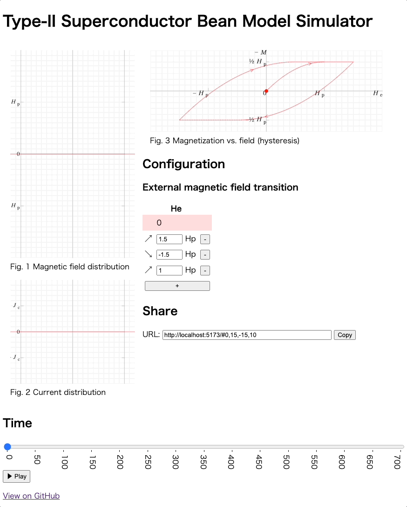

# Beansim

Type-II Superconductor Bean Model Simulator built on SvelteKit



## Developing

Once you've created a project and installed dependencies with `pnpm install`, start a development server:

```bash
pnpm run dev

# or start the server and open the app in a new browser tab
pnpm run dev -- --open
```

## Building

To create a production version of your app:

```bash
pnpm run build
```

You can preview the production build with `pnpm run preview`.

## Deploying

Pushing a commit to main will trigger a GitHub Actions workflow to build and deploy Beansim to GitHub Pages.

URL: https://toshikish.github.io/beansim/
